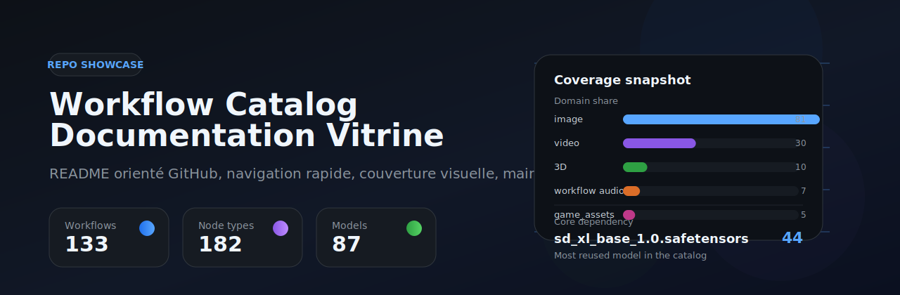
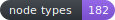
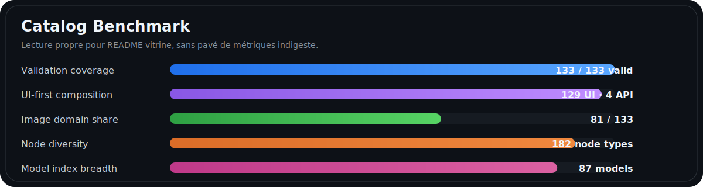
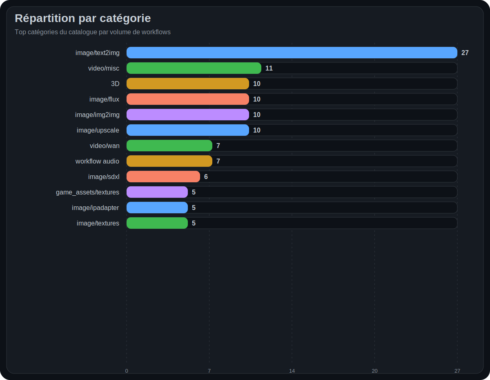
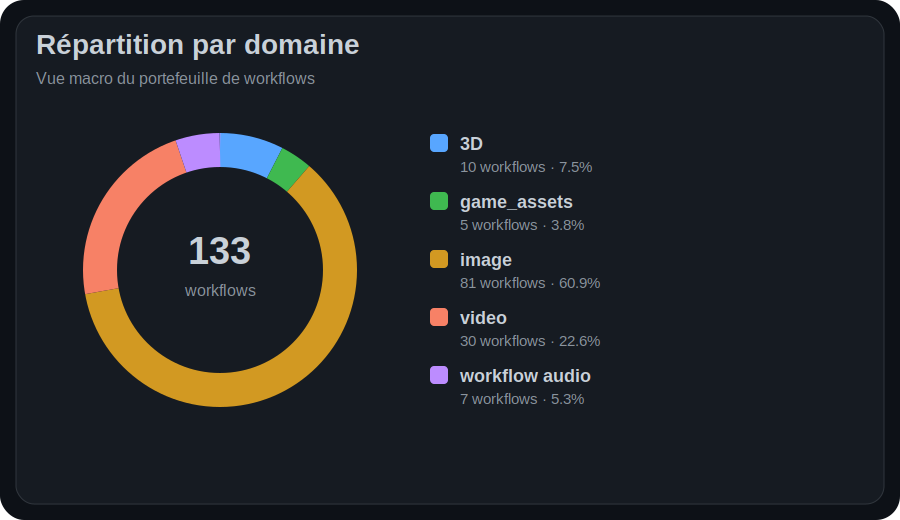
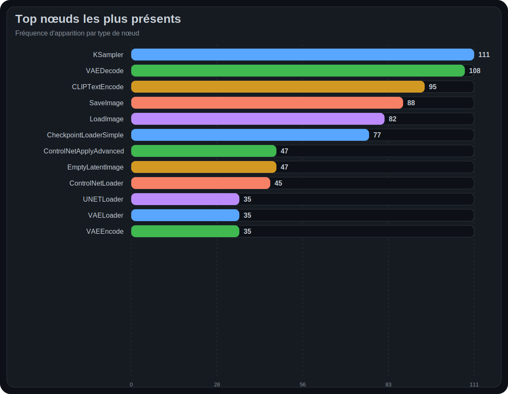
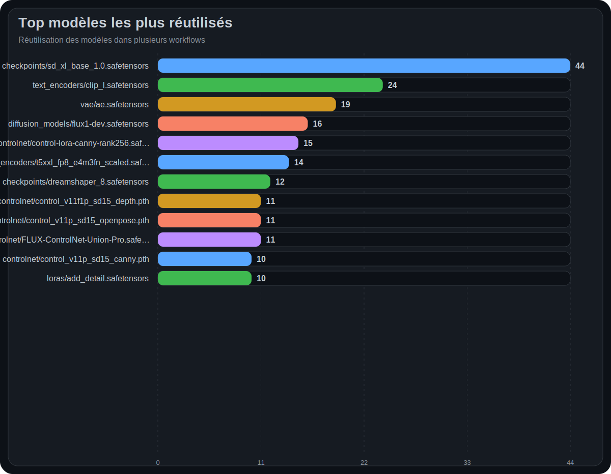
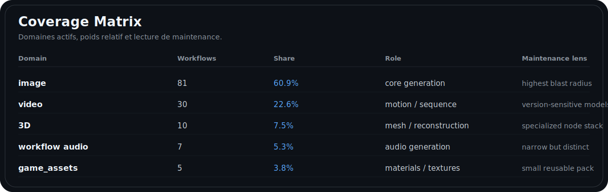

<div align="center">



# Workflow Catalog · Repo Showcase

<p>
  
  
  
  
  
  
</p>

</div>

---

## Table of Contents

- [Overview](#overview)
- [Quick Start](#quick-start)
- [Coverage](#coverage)
- [Repository Layout](#repository-layout)
- [Maintenance](#maintenance)
- [Roadmap](#roadmap)
- [Detailed Documentation](#detailed-documentation)

---

## Overview

Le catalogue couvre **133 workflows** validés, avec une base très majoritairement orientée **UI** (129) et un cœur d'usage centré sur **image/text2img**. La dépendance la plus réutilisée est **`checkpoints/sd_xl_base_1.0.safetensors`** avec **44** occurrences, ce qui en fait le premier point de contrôle pour la maintenance transverse.

<picture>
  
</picture>

## Quick Start

### 1) Lire le README
Commencer ici pour comprendre la structure générale, la couverture et les zones à fort impact.

### 2) Aller à la synthèse
Ouvrir [`01_SYNTHESIS.md`](01_SYNTHESIS.md) pour la vue d'ensemble visuelle et les principaux points d'interprétation.

### 3) Descendre vers l'opérationnel
- [`02_WORKFLOWS.md`](02_WORKFLOWS.md) pour trouver un pipeline cible
- [`03_NODES.md`](03_NODES.md) pour l'audit technique des nœuds
- [`04_MODELS.md`](04_MODELS.md) pour les dépendances et migrations modèles

### 4) Utiliser la version HTML
[`index.html`](index.html) sert de variante locale, plus démonstrative pour lecture hors GitHub.

## Coverage

<table>
  <tr>
    <td width="50%"></td>
    <td width="50%"></td>
  </tr>
  <tr>
    <td width="50%"></td>
    <td width="50%"></td>
  </tr>
</table>

<picture>
  
</picture>

### Coverage highlights

| Axis | Signal | Interpretation |
|---|---:|---|
| Primary domain | **image** | Main blast radius for maintenance and QA |
| Secondary domain | **video** | Motion pipelines and model-version sensitivity |
| Structural pillar | **KSampler** · 111 | Most central node family in the catalog |
| Main dependency | **sd_xl_base_1.0** · 44 | First compatibility checkpoint |
| Median density | **14 nodes / 16 links** | Workflows remain reasonably auditable |

## Repository Layout

```text
documentation_pack_showcase/
├─ README.md
├─ 00_NAVIGATION.md
├─ 01_SYNTHESIS.md
├─ 02_WORKFLOWS.md
├─ 03_NODES.md
├─ 04_MODELS.md
├─ index.html
└─ assets/
   ├─ hero.svg
   ├─ badges/
   │  ├─ workflows.svg
   │  ├─ valid.svg
   │  ├─ formats.svg
   │  ├─ nodes.svg
   │  ├─ models.svg
   │  └─ focus.svg
   └─ charts/
      ├─ 01_categories.svg
      ├─ 02_domains.svg
      ├─ 03_top_nodes.svg
      ├─ 04_top_models.svg
      ├─ 05_benchmark.svg
      ├─ 06_catalog_benchmark.svg
      └─ 07_coverage_matrix.svg
```

## Maintenance

### Priority map

| Priority | Scope | Why it matters | First action |
|---|---|---|---|
| **P1** | Core models | High reuse across the catalog | Validate `sd_xl_base_1.0`, `flux1-dev`, major text encoders |
| **P1** | Central nodes | Breakage would propagate widely | Smoke-test `KSampler`, `VAEDecode`, `CLIPTextEncode` |
| **P2** | Control stacks | Strong coupling in guided pipelines | Recheck ControlNet loaders and preprocessors |
| **P2** | Video families | More version-sensitive and heterogeneous | Lock model versions and keep reference outputs |
| **P3** | Specialized 3D / audio | Lower volume but specialized failures | Keep dedicated validation cases |

### Suggested maintenance routine

- **After any model update**: revalidate the highest-reuse workflows first.
- **After node-pack changes**: test one workflow per major family: image, video, 3D, audio.
- **Before release**: verify benchmark images, broken relative paths, and index cross-links.
- **For long-term hygiene**: add example outputs and compatibility notes by workflow family.

## Roadmap

> Proposition de roadmap de documentation, pas une vérité tombée du ciel.

- **R1 · Example Gallery**  
  Ajouter une galerie d'outputs par grande famille de workflow.

- **R2 · Compatibility Matrix**  
  Documenter les versions ComfyUI, packs de nœuds et dépendances critiques.

- **R3 · Per-workflow Metadata**  
  Ajouter difficulté, temps d'exécution cible, VRAM estimée, statut de test.

- **R4 · Release Notes**  
  Journaliser les changements de modèles, nœuds, et workflows à fort impact.

- **R5 · QA Harness**  
  Prévoir une petite matrice de smoke tests par domaine pour éviter les régressions idiots. Les classiques.

## Detailed Documentation

- [`00_NAVIGATION.md`](00_NAVIGATION.md) · parcours recommandé
- [`01_SYNTHESIS.md`](01_SYNTHESIS.md) · synthèse visuelle et lecture guidée
- [`02_WORKFLOWS.md`](02_WORKFLOWS.md) · catalogue des workflows
- [`03_NODES.md`](03_NODES.md) · nœuds, fréquences, familles dominantes
- [`04_MODELS.md`](04_MODELS.md) · index des modèles et dépendances
- [`index.html`](index.html) · miroir HTML local

---

<div align="center">

**Showcase-ready, GitHub-friendly, maintenance-aware.**

</div>
